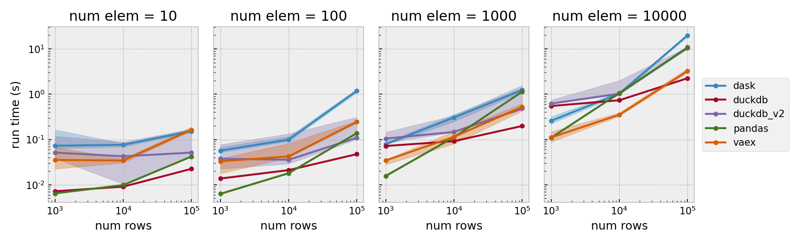

# Parquet join query

In this quick experiment we benchmark the performance of a few different tools on querying large vector data from a [parquet](https://parquet.apache.org/) database.

## Setup

In [generate_datasets.ipynb](generate_datasets.ipynb), we construct synthetic datasets consisting of:

- An `attrib` table containing two columns: an integer `index` in `[0, nrows)` and a random float `attrib` in `[0, 1]`.
- An `arrays` table also containing a matching `index`, as well as an `array` column containing random NumPy arrays of shape `(nelem,)`.

These datasets are of modest size, ranging up to 100K rows and 10K array elements (32GB).

In [query_benchmark.py](query_benchmark.py), we query from the `arrays` table using a filter generated from `attrib`. We benchmark the following tools on this task

- [Dask](https://www.dask.org/): a flexible library for parallel computing in Python.
- [DuckDB](https://duckdb.org/): an in-process SQL OLAP database management system.
- [Vaex](https://vaex.io/): a python library for lazy Out-of-Core DataFrames.

As a baseline, we compare the tools with a "naive" approach using [pandas](https://pandas.pydata.org/).

## Results

We observe that no single tool performs the best across data scales (from 136K to 32GB). The "naive" pandas baseline performs the best at the small and medium scales, and is only overtaken by DuckDB and then Vaex at larger scale.

We compared two approaches using DuckDB. One using the pandas-like python API ("duckdb"), and the other interfacing directly with the DuckDB SQL engine via `conn.query()` ("duckdb_v2"). Oddly, the second approach performed worse and showed more variability.

Finally, in all cases it appears the overhead associated with Dask was too high. Whereas the other tools run in a single process, Dask (which is designed for very large-scale parallel applications) attempts to distribute work over several processes.

## Comments

We tried to add a comparison using pure [PyArrow](https://arrow.apache.org/docs/python/index.html). However PyArrow [does not support join operations on tables with binary vector data](https://stackoverflow.com/questions/73071105/listitem-float-not-supported-in-join-non-key-field).